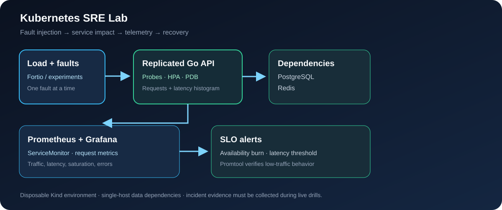

# Kubernetes SRE Lab

 

A failure-driven reliability lab for Kubernetes. A Go API uses PostgreSQL and Redis, emits request counters and latency histograms, and runs behind probes, HPA, a PDB and NetworkPolicies. Controlled experiments connect faults to user-visible symptoms, telemetry and recovery.



## Reliability model

| Objective | Target | Measurement |
|---|---|---|
| Availability | 99.9% successful requests over 30 days | Request counters and multi-window burn alerts |
| Latency | 99% of requests below 500 ms over 30 days | Histogram buckets and short-window alert |
| Maintenance | Two API Pods available during voluntary disruption | Three baseline replicas, PDB and rollout settings |

Alert expressions, including a low-traffic outage case, are tested with `promtool`. The 30-day objectives describe a target; a short Kind lab does not prove a 30-day SLO.

## Requirements and quick start

Linux with Docker, `kind`, `kubectl`, Helm 3 and capacity for one control plane and three worker containers. Bootstrap needs access to Cilium, monitoring and image registries.

```bash
make cluster
make deploy
make validate
make smoke
kubectl -n sre-lab get pods,hpa,pdb,servicemonitor,prometheusrule
```

`make deploy` installs Cilium, Metrics Server and Prometheus/Grafana, builds and loads the local Go image, and installs the Helm chart. The API performs a PostgreSQL query and Redis increment per successful request; readiness checks both dependencies. Prometheus scrapes `/metrics` through a ServiceMonitor. A password is generated into a Kubernetes Secret for this disposable lab.

## Experiments

Run one experiment at a time from context `kind-sre-lab`. Record baseline metrics, start/end time, events, observed SLI, recovery and post-recovery SLI using [the experiment method](docs/EXPERIMENT-METHOD.md).

| Script | Fault or action | Expected observation |
|---|---|---|
| `experiments/cpu-saturation.sh` | Sustained requests | CPU metrics and HPA decision |
| `experiments/oomkill.sh` | Memory above the container limit | `OOMKilled` and restart state |
| `experiments/bad-readiness.sh` | Invalid readiness path | Pod leaves ready endpoints |
| `experiments/error-rate.sh` | Injected 5xx traffic | Availability budget burn |
| `experiments/latency.sh` | 750 ms server delay | Histogram shift and latency alert |
| `experiments/dns-failure.sh` | Invalid Redis DNS name | Readiness and request failures |
| `experiments/bad-rollout.sh` | Unavailable image | Stalled rollout |
| `experiments/drain-worker.sh` | Worker disruption | Eviction and PDB behavior |

Mutating scripts print recovery instructions. Worker drain checks the Kind context and node name because it affects the whole cluster. See [high error rate](runbooks/HIGH-ERROR-RATE.md) and [Pending Pod](runbooks/POD-PENDING.md) runbooks for investigation order.

## Validate and collect evidence

The `validate` workflow runs Go tests/vet, Helm, kubeconform, Trivy and Prometheus checks. The `e2e` workflow provisions Kind and runs a smoke check. `make evidence` captures workload/monitoring state in ignored files; redact operational details before publishing.

```bash
cd app && go test ./... && go vet ./... && cd ..
make validate
make evidence
```

PostgreSQL uses a local single-replica volume and Redis is ephemeral. This single-host Kind lab does not claim resilient data services.

Licensed under [MIT](LICENSE).
